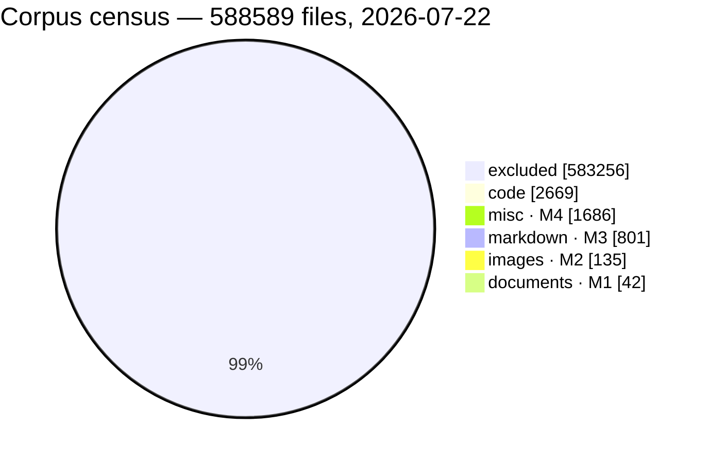
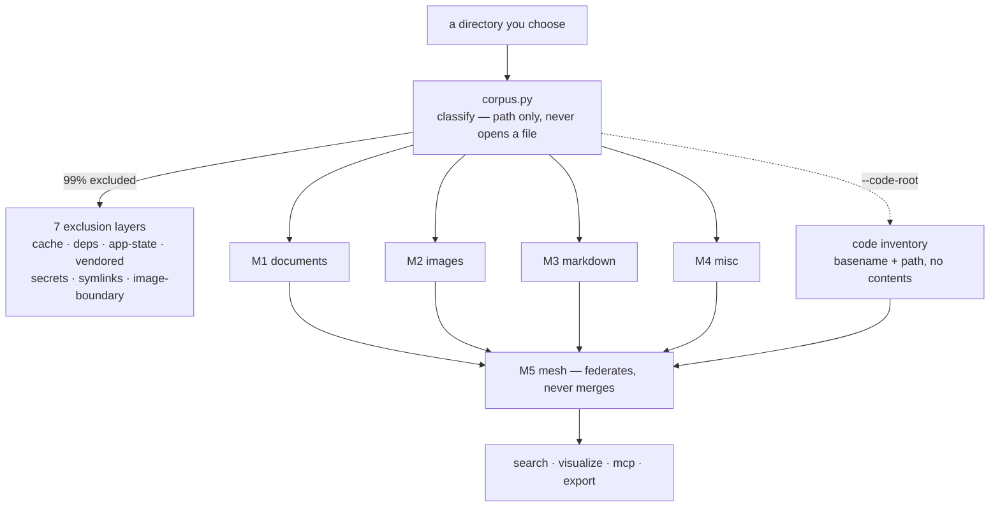
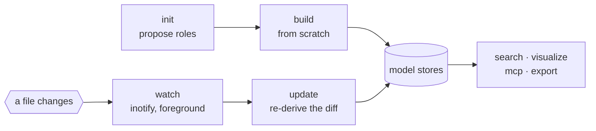

# Home-view-graph

A five-model knowledge graph over a directory you choose. Every number below
was measured, not estimated -- but read the date on each one, because a home
directory moves.

The Python package, the CLI and the config directory keep the shorter name
`homegraph`: they are typed, scripted and symlinked, and renaming what people
type to match what the project is called buys nothing and breaks their muscle
memory. **Home-view-graph** is the project; `homegraph` is the command.

## What is here

The numbers come from one survey, taken 2026-07-22, of a lived-in home
directory with 588 589 files:

```
588 589 files scanned
583 256 excluded  (99.09%)
  2 669 code
  1 686 misc      (M4)
    801 markdown  (M3)
    135 images    (M2)
     42 documents (M1)
```



That census is a **snapshot**, frozen into a file that is not distributed (it
is 74 MB of one person's filenames). CP-0 grades the classifier against that
file rather than against the live filesystem, so the checkpoint stays
reproducible -- and cannot notice when the filesystem underneath it changes. It
already has: a live `homegraph census` later the same day returned 448 374
files and 355 code, because a 143 000-file project directory had been deleted
in between. Nothing was wrong with the classifier; the corpus moved. Run
`census` for today's numbers, and treat the block above as the graded baseline.

The exclusion figure is the headline, not a footnote. Signal-to-noise for
images before rules is roughly 1:530, and no random sample at any realistic
directory level returns the user's own code -- dependency trees dominate every
root. Defining the corpus *is* the work; extraction is the easy part.

## The shape

One classifier decides which of five partitions a path belongs to; four models
build a store each, a code inventory rides alongside, and the mesh federates
them without merging. The 99% that is excluded is the largest box on purpose.



## No layout is assumed

homegraph does not expect a `Pictures` folder, or any other folder. It cannot:
a directory name is a fact about one machine and one desktop language, and a
rule that names one fails **silently** everywhere else -- the boundary matches
nothing, every image is excluded, and the image model builds zero nodes while
reporting success.

So the layout is declared once, by you:

```sh
homegraph init                      # scans your home directory
homegraph init --root /srv/archive  # or any other directory
```

`init` walks the root and proposes which folders hold images, based on the
**extension mix actually inside each one** rather than on a list of names. It
shows you the evidence, lets you overwrite the line, and writes
`~/.homegraph/config.toml`. That file is the truth about this installation;
edit it whenever you like.

```toml
root = "/srv/archive"

[roles]
image = ["Photos"]
```

One role, and only one. This example used to list five — `document`, `note`,
`code` and `cache` alongside `image` — and a config copied from it is
**rejected**, because those four were retired: they were roles nothing read,
and a role nobody consults is a promise the config cannot keep. `load()` names
each retired role and says what replaced it rather than ignoring it. What
decides whether a file is a document or a note is its extension, in
`categories.toml`; what `cache` used to mean now lives in `[cache]` in
`exclusions.toml`.

Commands that need to know your layout — `init`, `census`, `explain`, `build`,
`update`, `md build` — **refuse with exit 2** until the config exists, and say
what to run. Commands that only read a store already built — `status`,
`search`, `visualize`, `mesh`, `mcp` — do not consult the config and do not
refuse; they take a database path and answer from it. (This paragraph used to
say "every other command", which was broader than the code: those five exit 0
without any config at all.) An empty role is a legitimate answer and not an
error: the matching model is simply absent, and `mesh` labels its answers
`partial` and names it.

Two properties this rests on, both checked in CP-7:

- **The image boundary lives in exactly one place**, `[image_boundary]` in
  `exclusions.toml`, which expands `{image_roots}` from your config.
  `models/m2_build.py` *reads* that list to name collections; it does not
  re-test the boundary. See §2 of `DECISIONS.md` for what happened the first
  time it was in two places.
- **The scanner is not a second classifier.** It runs once, at `init`, writes
  its answer down, and is never consulted again. CP-7 asserts structurally that
  nothing but `cmd_init` imports it.
- **`init` never opens a file in the corpus.** It reads names and `stat()`, the
  same invariant M2 carries, verified the same two ways -- an audit hook and
  strace. It does read its own rule files and write your config; the claim is
  about the tree it is scanning, which is what CP-4 measures.

The synthetic test corpus is built with Norwegian directory names and then
rebuilt with English ones at a second root, under two configs. CP-7 asserts
that the two partitions are label-for-label identical. If they were not, some
layout would still be imposed.

## Layout

| module | what it does |
|---|---|
| `userconfig.py` | `~/.homegraph/config.toml`: the root and what is under it |
| `scan.py` | `init`'s one-shot role proposal, from extension mix |
| `corpus.py` | the single `classify(path)`. Path-only, never opens a file |
| `rules/*.toml` | exclusion layers, category map, image filename grammar |
| `store.py` | SQLite schema, migration chain v1→v2, versioned edges with method/confidence, FTS5 |
| `lock.py` | one writer per store: lock file plus `BEGIN IMMEDIATE`, refuses rather than queues |
| `query.py` | the closed query language; grammar in `DECISIONS.md` section 25 |
| `temporal.py` | observations, `datelist_int` bitmask, 90-day retention |
| `search.py` | FTS5, static-vector rerank over the FTS shortlist, RRF fusion, `_out_mode`, `--mode auto\|vector\|fts` |
| `providers/static_embed.py` | the static lookup-table embedder: identifier-split, weighted mean-pool, L2 — a data file, never the network |
| `providers/ollama.py` | the opt-in network embedder: `/api/embed` over `urllib`, dim measured not declared, vectors L2-normalised on the way in |
| `providers/__init__.py` | which provider a config or an `--embeddings` locator names; an unknown one is refused, never defaulted |
| `incremental.py` | mtime+size, then hash to confirm |
| `update.py` | applies that diff to a built model, and drops the vector of anything it rebuilds |
| `models/m1_*` | documents: pdf, odt, docx, tex |
| `models/m2_*` | images: filenames and `stat()` only |
| `models/m3_*` | markdown: the richest edge set |
| `models/m4_misc.py` | everything else, plus cold-state rollup |
| `mesh.py` | M5: federates the models, never merges them |
| `visualize.py` | force layout in Python, canvas in the browser, one file |
| `mcp_server.py` | MCP over stdio: `mesh_search`/`neighbors`/`path`/`explain` |
| `gui.py` + `assets/gui.html` | the same answers over HTTP on 127.0.0.1: payloads and routes in Python, a page that only draws |
| `portable.py` | node keys with the root taken out, and put back |
| `export.py` / `importer.py` | the portable artifact: lzma JSON Lines, digest in a trailer |
| `cli.py` | `init`, `config`, `explain`, `census`, `query`, `status`, `search`, `md …`, `mesh …`, `visualize`, `gui`, `mcp`, `update`, `watch`, `build`, `embed`, `export`, `import`, `inspect` |

## What the edges say

| model | relations |
| --- | --- |
| M1 documents | `CONTAINS` · `AUTHORED_BY` · `CITES` · `SAME_AUTHOR` · `REFERENCES_FILE` |
| M2 images | `IN_COLLECTION` · `NAMED_DATE` · `SAME_RESOLUTION` · `SERIES_MEMBER` · `LIKELY_COPY` |
| M3 markdown | `CONTAINS` · `WIKILINKS_TO` · `LINKS_TO` · `EMBEDS` · `TAGGED` · `MENTIONS_PATH` |
| M4 misc | `BELONGS_TO_APP` · `SAME_FORMAT` · `ARCHIVE_CONTAINS` (zip only; `.xpi` declined by policy) |
| M5 mesh | `FIGURE_FOR` · `MENTIONS_FILE` · `TEMPORAL_COHORT` · `CITES_CODE` |

`mesh search` answers from the four models **and** from the code inventory,
which appears as a fifth source called `code`. A code stub carries a basename
and a path and no contents, so it answers *which file* -- printed under the
hit, since a basename alone is ambiguous -- and never *what is in it*. Without a
`--mesh-db`, or without `--code-root` having been run, the search says that
code was not consulted rather than returning zero hits and calling itself
complete.

Every edge carries the method it was derived by -- `exact` 1.0, `path_prefix`
0.7, `basename` 0.6, `mention` 0.5, `co-change` 0.45, `cohort` 0.4 -- and any
answer containing one below 1.0 comes back labelled. See `DECISIONS.md`
section 24.

This sentence enumerates a table and nothing keeps it in step. `co-change` was
missing from it for as long as the method existed, found by review rather than
by a red test: `EDGE_METHODS` and Graphify's mapping are held together by
`test_i4.py`, and this paragraph is held together by whoever remembers it.

The last three in that table were listed in the plan and were **not built**
until 2026-07-23, which is worth saying out loud: a documented relation nobody
draws is indistinguishable, to a reader, from one that ships. `CITES_CODE`
needs an inventory passed in (`--code-root`) because `code` is a corpus
category with no model behind it; `ARCHIVE_CONTAINS` reads a zip's central
directory and nothing else, and is the only place M4 reads past the 512-byte
header.

`DECISIONS.md` section 26 has the reasoning, the two gates the mutation harness
caught as untestable on their first draft, and the three defects an adversarial
audit found afterwards -- including one that had already shipped the same shape
twice: **a documented assumption (`M1 reads one file at a time`) that stopped
being true the moment a new relation landed, with nothing but a comment holding
it.**

## Install

Python 3.12 or newer, no runtime dependencies.

```sh
python3 -m venv .venv && . .venv/bin/activate
pip install .          # or `pip install -e .` to keep editing the source
homegraph init
```

Without installing, the same commands run as `python3 -m homegraph.cli …` --
but only from inside this repo, since nothing else puts the package on
`sys.path`.

## Try it

```sh
homegraph init --root ~
homegraph config                      # what this run would use

homegraph explain ~/some/file.docx    # which rule decided, and why
homegraph census --root ~/notes

homegraph md build /tmp/m3.db --root ~/notes
homegraph md backlinks /tmp/m3.db ~/notes/some-page.md
homegraph mesh search --model m3=/tmp/m3.db trails

# The federation, with the code inventory CITES_CODE needs. Without
# --code-root that relation is not computed, and the report says `absent`
# rather than 0 -- "nobody asked" is not "nothing found".
homegraph mesh build --model m3=/tmp/m3.db --model m1=/tmp/m1.db \
                     --mesh-db /tmp/mesh.db --code-root ~

# One self-contained HTML file -- open it in any browser, offline, forever
homegraph visualize --model m3=/tmp/m3.db --out graph.html

# Semantic search (H3), opt-in. Distil a matrix ONCE, build-time -- the only
# step that touches the network or a model, and it is a tool, not the package
# (dependencies=[] stays true):
uv run --with model2vec python3 tools/distill_matrix.py \
        --store /tmp/m3.db --out matrix.json
homegraph embed  --model m3=/tmp/m3.db                     # needs an [embeddings] config block
homegraph search /tmp/m3.db --embeddings matrix.json --mode vector "how memory persists"
# ...and the graph gets an abc/≈ toggle + click-a-node-for-similar:
homegraph visualize --model m3=/tmp/m3.db --embeddings matrix.json --out graph.html

# Or point at an Ollama you are already running (CP-I1). Same contract, same
# namespace rules, still opt-in and still no dependency -- urllib, not a client
# package. The endpoint is never assumed; you name it.
#   [embeddings] provider = "ollama", model = "all-minilm",
#                endpoint = "http://localhost:11434"
homegraph embed  --model m3=/tmp/m3.db          # only what has no vector yet
homegraph embed  --model m3=/tmp/m3.db --force  # ...and when the MATRIX changed
homegraph search /tmp/m3.db --embeddings ollama://bge-m3@localhost --mode vector \
        "how memory persists"
homegraph status /tmp/m3.db                     # says when coverage is partial
# Model choice is not a detail, and neither is provider choice. Measured on one
# lived-in Norwegian+English corpus, 6203 markdown nodes, 2026-07-25:
#
#   static potion-multilingual  dim  256    9 s   +5 MB   no server needed
#   ollama all-minilm     23M   dim  384    3 min +5 MB
#   ollama bge-m3        567M   dim 1024   20 min +20 MB
#
# `all-minilm` is English-only and it shows: on Norwegian queries it returned
# HIGHER cosine with WORSE hits -- the signature of a model working outside its
# language, and a reminder that a high score is not relevance. `bge-m3` gave the
# best hits at every probe in both languages. But the static matrix builds 136x
# faster, needs no process to stay alive, and trailed by a rank or two rather
# than by a category. Which of those is "better" depends on whether you will
# keep a server running.
#
# These are qualitative probes, not a labelled eval. The quantitative gap H3
# recorded -- a labelled paraphrase set -- is still open, and nothing above
# closes it.
# One vector per node, one namespace per store: `embeddings.node_id` is the
# primary key, so re-embedding with a second provider REPLACES the first one's
# vectors. Switching providers is a full re-embed, not an A/B.
# `visualize --embeddings` stays static-only and says so: the page inlines a
# word matrix so the browser can embed offline, and a server has none to inline.

# MCP server on stdio
homegraph mcp --model m3=/tmp/m3.db

# A portable artifact: lzma, root-relative, importable under any root
homegraph export --model m3=/tmp/m3.db --out graph.hgx
homegraph inspect graph.hgx            # what it carries, before taking it in
homegraph import graph.hgx --model m3=/tmp/new.db --root ~/somewhere-else
```

`export` defaults to `--redaction structure`: paths, titles and every edge,
but no file text. On a measured home corpus the text is 86% of the artifact
and all of it is yours. `full` carries it and says so on stderr. `shape`
hashes names and paths with sha256 and keeps the first prefix segment, so
`author:` stays `author:` and the graph keeps its shape while losing which
files it is about.

**`shape` is not anonymisation.** The digests are unsalted, so anyone who can
enumerate candidate paths can hash them and look for a match. It prevents
reading the graph; it does not prevent confirming a guess. `DECISIONS.md`
section 27 says so in full, including what a salt would cost.

The root is whatever you chose -- a home directory, one project, or a disk
full of them -- and an artifact imports under any other one. The mesh is not
in it: import the models and run `mesh build`, because a federation is cheap
to recompute and shipping it would mean shipping code stubs pointing at files
the receiving machine does not have.

## Updating without rebuilding

```sh
homegraph update --model m3=/tmp/m3.db --model m2=/tmp/m2.db \
                 --mesh-db /tmp/mesh.db --code-root ~
```

`incremental.py` computes the diff -- `added`, `changed`, `touched`,
`unchanged`, `removed`, cheap on mtime and size, confirmed with a hash.
`update.py` applies it: added and changed files are rebuilt, removed files and
their edges are deleted, `touched` (new mtime, identical bytes) costs one
`stat()` and no reparse, and `unchanged` costs nothing.

The claim is an equivalence, and it is the only one worth making:

> a store built on corpus A and updated to corpus B is indistinguishable from
> a store built on corpus B from scratch.

CP-8 checks it by comparing nodes and edges as **sets**, not counts -- counts
are equal when one node has been swapped for another, which is exactly what a
broken incremental path produces. The test corpus differs on all five axes,
because an equivalence gate over two identical corpora passes for any update
path, including one that does nothing.

Four things that fell out of writing it, all of which had been latent:

- **M3's link index is global.** Rebuilding three files resolved their
  `[[wikilinks]]` against those three files, declared every other target
  broken, and wrote `wikilink:` nodes for pages that exist. The equivalence
  gate caught it on its first run.
- **Neighbours have to be rebuilt too.** Deleting a page breaks every link to
  it, and adding one resolves every link to it, in files that did not change
  and that no per-file diff can see. `update` widens the rebuild set to those
  files. It is a heuristic and is labelled one; the equivalence gate is what
  makes it safe to ship.
- **`touched` could never fire.** No model stored a `content_hash`, so the
  stored hash was always NULL and every rewrite came back `changed`. The
  two-stage design in `incremental.py` had been decorative since it was
  written. M1 and M3 store it now.
- **A layout change is not a file change.** Changing the `image` role moves the
  boundary between two models; the paths do not move, so no diff can see it.
  `update` fingerprints the config into the store and refuses with exit 2
  rather than producing a store that mixes two configurations.

**Removal deletes, and it deletes history.** The alternative -- a tombstone --
cannot coexist with the equivalence claim, since a rebuild of B has no node for
a file that is not in B. That is a real loss and is written down in
`update.py`: after an update, `edges_as_of()` cannot show a relation only a
deleted file took part in.

**M4 is refused, not approximated.** Its cold-state rollup aggregates the whole
corpus into single nodes, so a per-file diff cannot be applied without breaking
the reconciliation CP-5 checks. `update` says so and exits 2.

## Watching for changes

`update` is manual. `watch` runs it for you when the corpus moves:

```sh
homegraph watch --model m3=/tmp/m3.db --mesh-db /tmp/mesh.db --code-root ~
```

It watches the root with inotify and re-runs the same `update` above after each
settled burst of changes -- one save that rewrites five files is one update,
not five. It is **foreground and opt-in**: nothing survives Ctrl-C, there is no
daemon, no autostart, no state left behind. The idea is borrowed from
`codegraph`; the daemon it came with is not, because this package runs no
long-lived services.



Two things keep it honest, and CP-13 checks both through the CLI:

- **An update never triggers itself.** The store writes it produces would
  otherwise arrive as fresh changes and it would update forever; those paths
  are ignored.
- **It watches only the corpus.** A naive recursive watch of a real home arms
  an inotify watch on each of ~51 000 directories, most of them `.cache` /
  `.venv` / `.git` churn. `watch` reuses the corpus classifier to prune those,
  and armed 676 watches instead on the home it was measured against.

## Exporting to an Obsidian vault

```
homegraph export-obsidian --model m3=m3.db --model m4=m4.db --vault ~/graph-vault
```

One markdown note per node: YAML frontmatter with the node's kind, subtype,
provenance and dates, and `[[wikilinks]]` built from edges that **already
exist** -- M3's `WIKILINKS_TO` / `LINKS_TO` / `EMBEDS`, the mesh's
`MENTIONS_FILE` / `FIGURE_FOR` / `CITES_CODE`, M1's `REFERENCES_FILE`. Nothing
is recomputed and no link is inferred from one title resembling another, so a
vault exported this way and indexed again is the graph it came from.

`--redaction` is the same flag `export` takes and means the same thing, because
it is the same function: `structure` (the default) carries paths, titles and
every link but no file text. A vault cannot leak more than a `.hgx` would.

Notes go in one directory per model, but names are unique across the **whole**
vault -- Obsidian resolves `[[name]]` vault-wide, so a name repeated in two
directories is a link that lands somewhere the graph did not point. Collisions
are resolved case-folded, because `plan.md` and `Plan.md` are two nodes on ext4
and one file on a case-insensitive filesystem.

**A vault that already holds files is refused** unless you pass `--force`. The
mistake this guards is pointing the command at a vault of hand-written notes.

No `.canvas` file is written. It is optional in the plan, and the JSON Canvas
schema was not readable from anything here -- see `DECISIONS.md` section 32 for
why that means "not written" rather than "written approximately".

Measured on the real corpus: **10 402 notes and 9 605 links in 1.3 s**, 4.3 MB,
every link resolving to a note that exists.

## Exporting to Graphify

```
homegraph export-graphify --model m3=m3.db --out project/graphify-out/graph.json
```

Writes the graph in Graphify's node-link form, carrying the fields Graphify's
own `validate_extraction` requires -- so **one file serves both consumers**:
`graphify merge-graphs` and `global add` load it, and it passes `assert_valid`.

The schema was read out of the installed package (0.9.16) and a real
`graph.json`, not guessed. Two things that follow from the reading:

- **`file_type` and `confidence` are closed sets** (six and three values).
  homegraph's 17 node kinds and 5 edge methods map onto them through explicit
  tables, and **an unmapped kind stops the export** rather than defaulting to
  `concept`. The numeric confidence is not lost to the three-valued enum -- it
  travels in `confidence_score`, the float field beside it.
- **Where you write it decides what nodes are called.** `merge-graphs` takes
  its per-repo prefix from the file's *grandparent* directory, so
  `<project>/graphify-out/graph.json` gives a readable tag and `~/graph.json`
  tags everything with your home directory's name. The command says so if you
  aim it somewhere else.

The file is a **multigraph**, because homegraph's edges are keyed by relation
and one pair of nodes can carry two. On the real corpus 23 pairs do, and a
simple graph drops one of each silently. `merge-graphs` then flattens to a
plain undirected graph on its side -- 13 509 of 13 745 edges survive that view,
losing the 23 parallel and 213 reciprocal ones. That is Graphify's decision
about a merged view, and a different thing from handing them a graph that had
already lost data.

Measured on the real corpus: **10 402 nodes and 13 745 links in 0.48 s**,
9.8 MB, zero validation errors from Graphify's own validator.

## Viewing the graph

`visualize` writes a single HTML file with the layout precomputed in Python and
the drawing done on a canvas. No D3, no CDN, no `fetch` -- the plan named D3,
but a 280 KB CDN pull would make the page useless offline and would be this
package's first runtime dependency.

Pan by dragging, zoom by scrolling, hover for the node key, filter by model,
search to highlight. If a model's store is missing the page says so in the
panel rather than quietly drawing a smaller graph.

**Pass `--mesh-db` or the page is four separate graphs on one canvas.** The
code inventory lives in no model, so without it the drawing has never heard of
a source file and its search box cannot find one -- while the CLI finds it.
With it, code appears as a fifth layer and the cross-model edges are drawn.
Only edges with both endpoints on the page: a mesh knows more nodes than a
capped drawing shows, and half an edge is not a relation.

## The GUI

`visualize` writes a file. `gui` serves one:

```sh
homegraph gui --model m3=~/.homegraph/m3.db --mesh-db ~/.homegraph/mesh.db
```

A foreground server on `127.0.0.1` that dies on Ctrl-C. No daemon, and **no
`--host` flag** -- this serves a whole home directory's corpus, and a switch
that could publish it is a switch somebody passes by accident. Reach it from
elsewhere with `ssh -L`.

**It is a second transport over the answer layer, not a second opinion about
it.** Every route calls the same `mcp_server.Server` an MCP client talks to:
`/search` is `mesh_search`, `/query` is `query`, `/path` loops `mesh_path`,
`/neighbors` is `mesh_neighbors`. Nothing in `mcp_server.py` was modified to
make that work. The reason is the one in *Credits* about `CITES_CODE`: two
implementations of the same question eventually answer it differently, and a
browser reimplementation of FTS5 and cosine would be exactly that.

So the page decides nothing. Positions, which nodes are files, which stand
alone, which path won, what was truncated, which neighbours are derived --
all computed in Python, shipped ready, and therefore under test. The layout is
seeded and computed once, so the same corpus draws the same picture twice and
this week's screenshot can be laid beside last week's; a search highlights in
place and never moves a node.

**The isolated band is the `md gaps` finding made visible.** Files with no
edge park in a sorted band along the bottom with their count and share, rather
than being scattered by a force layout -- a node with no edge has no
information in its position, and a position without information draws noise
that looks like data. On the real corpus at four models that band is **1 763
of 2 472 file nodes, 71,3 %**.

Click a search hit and the lower pane draws the **bridges** between it and the
other hits: are these five findings one matter or five? A destination with no
path within the depth is drawn detached and named -- "no path" is an answer,
and omitting it would let four bridges out of five look complete. When there
is no bridge at all, the pane falls back to the clicked file's neighbourhood,
incoming left and outgoing right, with **derived relations drawn dashed**
(`confidence < 1.0`, the same rule `provenance_note` applies everywhere else).

The filters in the left pane dim and hide by model and by file type. They
never refetch and never re-lay-out, for the same reason a search does not: a
position has to mean the same thing all session. A filtered view says how much
it hides, because a third of a corpus must not read like the whole of it.

**Ceilings, measured rather than assumed.** Startup is **1,55 s and 0,96 MB
for 2 472 nodes**, paid once before the browser opens. Click accuracy falls
with corpus size: band nodes sit 3,65 x 4,17 px apart against a 10 px hit
radius, so a click there can select a neighbour -- the schematic names the
node it answered about, which makes that visible and correctable, not
accurate. Ten times this corpus has not been tried.

## Tests

```sh
uvx pytest -q tests/                                            # 29 modules
for h in cp0 cp1 cp2 cp3 cp4 cp5 cp6 cp7 cp8 cp9 cp10 cp11 cp12 cp13 \
         gui h1 h2 h3 h3_crosslingual h3_graph i1 i2 i3 i4 idx h3_para; do
    python3 tests/mutate_$h.py
done
python3 tests/mutation_coverage.py         # which checks no mutation aims at
python3 tests/test_cp0.py                  # any checkpoint runs standalone too
```

Neither line needs `uv`: after `pip install .`, `python3 -m pytest -q tests/`
does the same thing, and every checkpoint runs standalone with no test runner
at all.

`test_no_real_paths.py` fails in a fresh clone, and that is deliberate: the
material it proves is not published is gitignored and therefore absent, so the
gate refuses to pass rather than report "nothing leaked" when there was nothing
present to leak.

**Twenty-five checkpoints plus a privacy check and a suite-completeness check.
624 mutations across 34 harnesses, 0 survived, 0 detected only by a crash, 1
killed by a gate other than the one named**, measured 2026-08-02 on the CP-H7
working tree by running every harness in one sweep rather than one at a time --
a harness that passes standalone can still survive in a full one. The whole
sweep takes **1 546 seconds**. The single misattribution is `mutate_i3`'s *a
tool is implemented but never advertised*, caught by the round-trip gate rather
than by the advertisement gate it names.

**A sweep before this one reported two, and the second was a coin.**
`mutate_gui`'s *layout takes a fresh random seed* drew its seed with
`random.randrange(99)`, and `_layout` is pure in its seed -- so whenever the
two draws collided, the two builds the determinism gate compares came out
identical and that gate stayed green. The mutation was still caught, by the
HTTP gate comparing an in-process payload against the server's, so it surfaced
as a misattribution rather than as a survivor: named correctly in six sweeps
that day and differently in the seventh, on an untouched file. One in 99 per
run, 6.9 % over seven, observed once. It counts now instead of drawing, because
**a mutation has to exercise the defect it names every time or its verdict is a
coin** -- and a verdict that varies across runs of identical code is the same
family as a mutation that passes standalone and survives in a sweep.

**The sweep before this one was red, and every harness in it passed
standalone.** CP-H4 edited three lines that three older mutations were
anchored to -- the mesh fusion key, the shape-export drop list, the
CONTRIBUTING loop -- and a mutation whose anchor text no longer matches is
counted as a survivor rather than skipped. That is the second time in a week
the same shape has been caught, and both times only by running the whole set.

**Every suite in `tests/` now has a mutation harness.** Four did not until
2026-08-01, and they were not the small ones: the review-findings suite (the
five defects a rule set found that pyright, mypy, ruff and codex all passed),
the privacy gate, the type-regression pair, and the suite-completeness guard
itself -- 58 checks between them at 0 % coverage, which is to say nobody had
put any of those defects back to see whether the checks still said no.

Roughly half of the 25 mutations aim at the **negative controls** rather than
the defects, because a guard that fires on everything passes every positive
check in the suite it guards. That half found two real holes. The control
proving the model-spec parser does not refuse *everything* caught `Exception`,
while the parser refuses through `SystemExit` -- a `BaseException` -- so a
parser that refused everything tore the suite out of `main()` before the report
was written, and the check could not go red at all. And the privacy gate's
generic band had no canary: a `_hits` that matched nothing passed every check
in the file, on the band that carries the absolute-path pattern. The digest
band had been guarded that way since it was written; its neighbour had not.

The loop above is itself checked now. `test_suite_is_complete.py` asserts that
every `mutate_*.py` on disk is named in it and that it names no harness that
does not exist -- the same hardcoded-list failure as everything else in that
file, one level out. It already narrowed once, to 14 of 24.

**The first attempt at that sweep is the reason the sentence above can be
trusted.** It reported one survivor: `mutate_cp2`'s *markdown files are read but
not all stored*, as `needle missing`. CP-IDX had given `m3_build.build` an
`index_file` argument, which split its signature across two lines, and the
mutation's anchor text stopped matching. A mutation that cannot be applied is
counted as a survivor rather than skipped -- which is the only reason anyone saw
it, because `mutate_cp2` passed standalone before and after. The anchor was
repaired and the whole sweep re-run rather than that one harness: a figure
assembled from a patched run and twenty-four older ones is not a sweep result.

The figure before that was the same 513 mutations on `c383991`, with **three**
misattributions rather than one: `66b1c80` fixed `mutate_cp12`'s two, leaving
only `mutate_cp6`'s. Before both, 442 mutations in 808 s on `3b78560`
(2026-07-26), also with three. The 71 added since are `mutate_gui`'s 54 and
the 15 `mutate_cp6` gained with CP-MESHKEY. **Nothing reported `needle missing`**,
which is the other thing a sweep is read for: a mutation whose anchor text has
been refactored away is counted as a survivor, not skipped, and finding none
means no harness has quietly stopped applying.

The loop above names every harness rather than `for t in 0..13`, which is what
it used to say: that ran the fourteen `mutate_cp*` files and none of the ten
others, so a reader following the README exercised 14 of 24 harnesses and had
no way to notice.

The one misattributed kill is `mutate_cp6`'s tool implemented but never
advertised, which names `all four mesh tools are advertised` and dies to
`every advertised tool can be called, and every callable one is advertised` --
a real gate rename from CP-MESHKEY. It died -- but the gate the mutation named
stayed green, which is the distinction the harnesses exist to see, so it is
reported rather than folded into the kill count.

`mutate_cp12`'s two were misattributed for a different reason and were fixed in
`66b1c80` rather than documented: neither was a stale name, and both mutations
had stopped being the defect they described. The boundary-test one deleted an
assignment as well as weakening a test, so the mutant raised `NameError` and the
harness read a crash as another gate's kill; the datelist one named a check that
exports at `redaction="full"` and therefore could never observe the constant it
dropped. A mutation that cannot be killed by the gate it names measures nothing,
so the entry is wrong rather than the gate.

The split of *how* they died is the fragile number and is timestamped for a
reason: it has moved twice within an hour of measurement.
**0 survived is the load-bearing claim**; a mutation moving between *the named
gate said no* and *the suite died* changes how much that kill is worth, so
re-run the harnesses after touching a checkpoint rather than trusting the
numbers here.

**Run the sweep, not the single harness.** A gate can pass standalone and be
flaky under load -- CP-I1 shipped one that raced a socket close, went green on
its own and survived its own mutation in a full run. Standalone is a smoke
test; the sweep is the measurement.

The table below stopped at CP-13 for two days while the H- and I-series were
being written, and nothing noticed, for the same reason `pytest` was not
collecting `test_i1.py` -- see `DECISIONS.md` section 33. Recounted, not
carried forward.

| harness | mutations | killed by the named gate |
|---|---|---|
| CP-0 corpus | 18 | 18 |
| CP-1 substrate | 22 | 22 |
| CP-2 markdown | 22 | 22 |
| CP-3 documents | 27 | 27 |
| CP-4 images | 17 | 17 |
| CP-5 misc | 22 | 22 |
| CP-6 mesh | 40 | 39 |
| CP-7 config | 33 | 33 |
| CP-8 update | 32 | 32 |
| CP-9 provenance | 31 | 31 |
| CP-10 query | 26 | 26 |
| CP-11 write barrier | 20 | 20 |
| CP-12 portable artifact | 33 | 33 |
| CP-13 foreground watch | 16 | 16 |
| H-1 static embeddings | 6 | 6 |
| H-2 matrix distillation | 6 | 6 |
| H-3 semantic search | 10 | 10 |
| H-3 graph page | 3 | 3 |
| CP-I1 Ollama provider | 23 | 23 |
| CP-I2 vector expiry | 6 | 6 |
| CP-I3 Obsidian vault | 14 | 14 |
| CP-I4 Graphify export | 13 | 13 |
| **total** | **440** | **437** |

The three mutations not in the right-hand column -- one in CP-6, two in
CP-12 -- were killed by a *different* gate than the one that named them — recorded rather than rounded away, because a
kill by the wrong gate means the named gate still tests nothing.

Two mutations rotted and were repaired on 2026-07-23: each one finds its target
by exact source text, and when CP-9 made `method` a required argument on
`upsert_edge`, the needles in CP-1 and CP-2 stopped matching. The harness
reports an unappliable needle as a **survivor**, which is the right call — a
score you did not earn is worse than a red line — but it only helps if someone
reads the summary.

An earlier revision claimed "48/48 killed". That was wrong: the harness counted
a crashed suite as a kill, which made the `expected` field decorative -- an
adversarial audit proved it by injecting a mutation that only broke an import
and watching it reported as killed. Kills, misattributed kills and crash-only
detections are counted separately now, because "the suite died" and "a gate
said no" are different facts and only the second one is evidence.

Each `test_cp*.py` is a script that prints a readable report and also exposes a
one-line pytest adapter. The adapter is not decoration: before it existed,
`pytest tests/` collected all seven files, found no `test_*` function, and
reported success having run **nothing at all**.

**The mutation suites are not optional.** Every single checkpoint passed green
on its first run and every single one still contained gates that tested
nothing. The recurring shape is vacuous truth: `all()` over an empty list is
`True`, so the file-size gate passed cleanly with the size cap removed
entirely; `len(a) <= len(b)` passes when the filter under test is gone and both
sides are equal. CP-7 and CP-8 contributed four more on their first run -- a
"corrupt config" case that was corrupt in the wrong way, a refusal whose
instruction was carried by two independent strings, a threshold nothing in the
fixture could trip, and an FTS-orphan check that ran *after* the cleanup that
erases the evidence.

## Nothing here names a real file

`tests/test_no_real_paths.py` greps everything git would publish for personal
identifiers, absolute home paths and localised directory names, and fails if it
finds any. It is a test rather than a promise because that guarantee decays
silently: one pasted path in a docstring, in a commit whose diff looks like a
comment change.

Three bands, at deliberately different strictness, and the reasoning is in the
file's docstring. The one relaxation: the *fixture* may name directories in any
language, because it creates them itself in order to demonstrate that the
package does not know them -- and the check verifies that every such name is
one the fixture actually plants.

The real-corpus material -- the inventory snapshot, four answer keys, the
per-checkpoint thresholds and the samplers -- stays local and git-ignored.
Every checkpoint refuses with a clear message when it is absent, rather than
falling back to the synthetic numbers and reporting a real-corpus run that
never happened.

## Static analysis

No external model was available for review (codex ran out of monthly quota,
fallow does not read Python), so the substitute stack is static analysis via
`uvx` -- nothing installed, no quota:

| tool | result |
|---|---|
| `uvx ruff check .` | clean |
| `uvx bandit -r homegraph/` | **found a real vulnerability** (below) |
| `uvx radon cc -a homegraph/` | average complexity **A**; two D blocks |
| `uvx vulture --min-confidence 80` | clean; at 60% it found real dead code |
| `uvx pytest -q tests/` | 13 passed |
| `uvx mypy homegraph/` | clean on 25 files, with strict on seven modules (see `pyproject.toml`) |

**Bandit found what a code review had not:** `xml.etree` parsing `.docx` and
`.odt` is open to entity expansion, and these documents come from the internet.
A 1 KB file can expand to gigabytes. Fixed with a DTD guard rather than a
`defusedxml` dependency, turning eight unguarded call sites into one guarded
chokepoint. The two findings that remain are the guard itself, which bandit
cannot see past, and `random.Random(seed)` in the layout -- flagged as
non-cryptographic, which is the point: the seed is fixed so the same graph
draws twice the same.

**Vulture found a self-inflicted duplication:** `Mesh.identity()` computed the
same thing as `Mesh._fusion_key()` and was never called. Two implementations of
identity is precisely what `DECISIONS.md` §2 warns against, committed in the
same codebase that documents the warning.

## Answer keys

Two corpora, and two sets of keys. **The synthetic corpus is the default**: it
is built by `tests/fixtures/synthetic.py`, carries every adversarial case the
real one produced, and generates byte-identically on any machine, so a fresh
clone can run all nine checkpoints with nothing installed and no fixture to
download. The real corpus is opt-in with `HOMEGRAPH_REAL_CORPUS=1`.

For the synthetic corpus every expected answer is **declared** in
`synthetic.py`, at the point the file is planted -- the fifteen link relations,
the eighteen filename readings, the five documents' metadata, the ten
FIGURE_FOR pairs, the installation config, and which files corpus B added,
changed, touched and removed. Nothing in that file ever calls `classify()`, the
filename parser, the markdown extractor or `extract()`. A key computed from the
thing it grades agrees with any implementation, including a broken one.

The order in which the real keys were written matters, but it is not the same
as independence, and the distinction was overstated here before. No row was
ever edited to make a test pass -- but the rules **were written with the answer
key open**, and `FASIT.md` names three exclusion rules that exist because a
gold row exposed the gap. That makes 60/60 a training score, not a held-out
one. There is no holdout set.

## Where this disagrees with the plan

Seven things the survey got wrong, all documented with evidence in
`tests/gold/FASIT.md`:

1. **The agent tool's state directory supplies no transcripts.** All 3 247
   markdown files there are vendored plugin documentation, 3 208 of them under
   `.tmp/`. The real transcripts are in SQLite.
2. **Markdown is 801 files, not 4 113** -- the rest is dependency noise.
3. **Documents are 42 across 4 types**, not 77 across 6. No pptx, no xlsx.
4. **None of the six document libraries is installed.** The degradation path
   was the starting state, so the extractors are stdlib-only.
5. **The image directory holds 137 files, 2 of them `.docx`.** So
   `count(image) == 135`, and "under the image root" is necessary for the
   category and never sufficient.
6. **1 365 of 1 465 broken wikilinks are machine-generated** cluster labels
   from graph reports, not human intent.
7. **CP-5's rollup threshold is unusable** -- it assumed 87 000 M4 nodes; the
   exclusion layers already removed them.

## Credits

**Ideas borrowed, code not.** Not a slogan: every item below was reimplemented
here from the idea, and where a borrowed design was found to be wrong it was
inverted rather than copied -- which is itself a debt, and is recorded as one.

### `code-review-graph`

The largest debt, and still a live dependency of the design rather than a
historical one.

- The **schema shape**: SQLite plus FTS5, a migration chain, versioned edges,
  the incremental mtime-then-hash diff, and MCP over stdio.
- **RRF fusion over ranks**, and the reason for it -- BM25 scores from separate
  indexes are not comparable.
- The **postprocessing pipeline** shape.
- **It is still the code model.** `CITES_CODE` deliberately does not read
  source: `code` is a corpus category here with no store behind it, because
  reading code is code-review-graph's job and duplicating it would be a second
  opinion about the same files. See `DECISIONS.md` section 26.
- Two of its **bugs, taken as design constraints**: a silently unbuilt vector
  index (issue #711) and a test suite that wrote into the home directory
  (#712). PR #710 was sent back upstream.
- **`get_knowledge_gaps`**, which became `md gaps` (CP-G, 2026-07-27). The
  idea is that a graph should be able to name what it does *not* connect, not
  only what it does. Reimplemented against M3's edge table; the number it
  produced -- 315 of 602 markdown files (52.3%) with no link to or from
  another -- is the only measured argument for borrowing it, and it is the
  reason this one was taken while four other candidates from the same
  comparison were not.

### `Graphify`

- **`merge-graphs`** -- the shape the federation layer needed: query the parts,
  fuse in memory, never merge the stores.
- Its **output taught the corpus a rule it did not have.** 1 365 of 1 465
  broken wikilinks turned out to be `[[_COMMUNITY_…]]` cluster labels from
  generated graph reports, which is where the `generated` subtype came from.
  A borrowed lesson rather than a borrowed design, and worth naming as one.
- **Its JSON schema**, read out of the installed package (0.9.16) for
  `export-graphify` (CP-I4): the node-link shape `merge-graphs` consumes, the
  closed `file_type` and `confidence` vocabularies, the `confidence_score`
  float that sits beside the enum, and the fact that `merge-graphs` derives a
  repo prefix from the file's grandparent directory. Read, never guessed --
  the plan made that a precondition for building this at all, and the gates
  check the output against Graphify's own validator rather than against ours.

### `DeusData/codebase-memory-mcp`

Measured against `code-review-graph` on 2026-07-23 with five known-answer
cases. It lost on three of them, **silently** -- and five of its ideas were
still worth taking:

- The **admission barrier** behind its write path, which became `lock.py` (the
  daemon it hangs off was not borrowed; this package runs no services).
- **`truncated` in a report** -- a capped list must say it was capped.
- **Provenance and confidence on edges**, taken *inverted*: cbm carries a
  `confidence` and hands the answer back as clean JSON with no warning. Here
  anything below 1.0 makes the answer say `partial`. **A confidence field
  nothing forces you to read is decoration.**
- A **closed query language** over the graph.
- A **portable artifact** (`--persistence`), which is TODO-E.

### `colbymchenry/codegraph`

Measured against `code-review-graph` on 2026-07-23 with the same five
known-answer cases. It lost the same way cbm did -- three silent misses on the
function-local-import homonyms (`scan`, `build`), with no confidence field at
all this time -- so `code-review-graph` stays the code model. One idea was
worth building and one was worth recording as a warning:

- **React to OS filesystem events instead of polling**, which became
  `homegraph watch` (`watch.py`). Taken *without* codegraph's daemon: this
  package runs no long-lived services, so the watch is foreground and opt-in --
  inotify while the command runs, nothing after Ctrl-C. It triggers the same
  `update` a user would run by hand, and reuses the corpus classifier to watch
  only the corpus tree (676 directories on this home, not the 51 661 a naive
  recursive watch would arm).
- **Its single `explore` tool, taken *inverted* as an anti-pattern.** codegraph
  wraps a silently-wrong answer in "this is the verbatim on-disk source, do not
  read the file yourself" -- authority framing that makes a miss harder to
  catch, not easier. The lesson here: never dress an uncertain answer in
  language that discourages verification. It is why `provenance_note` says
  `partial` out loud rather than presenting a guessed edge as fact.

### `codegraph-ai/CodeGraph`

The source of the **H1–H3 harvest** (2026-07-24).

- **Eval before mechanism** (H1): decide whether semantic search helps by
  *measuring* it — recall@k / MRR over labelled pairs — not by feel. The
  scoreboard was built before the embedder it grades.
- **Static lookup-table embeddings** (H3), the model2vec pattern: an embedding
  is arithmetic over a distilled `vocab × dim` matrix — tokenise, look rows up,
  weighted mean-pool, L2-normalise — so semantic search costs no runtime
  dependency and no network. Distillation is build-time; the "model" is a data
  file. **FTS shortlist → cosine over the union → RRF**, never a whole-corpus
  scan; the `provider:model:dim` namespace with re-embed-on-change; identifier
  splitting (`getUserById → get user by id`, +6% recall).
- Its **anti-patterns confirmed choices already made**: a heavy embedding
  runtime (a static lookup avoids it), auto-downloaded models (an explicit data
  file instead), hashing counts rather than content.

### `minishlab / model2vec`

The distillation technique H3's build-time tool applies, and the pre-distilled
`potion-multilingual-128M` static model the real matrix was made from
(`tools/distill_matrix.py`). A build-time tool run through `uv`, never a runtime
dependency — the package stays `dependencies=[]`.

### `Ollama`

The local inference endpoint the second embeddings provider speaks to
(`providers/ollama.py`, CP-I1). Borrowed as a **protocol, not a package**: the
`/api/embed` request and response shape, reimplemented over `urllib` from the
standard library, so `dependencies = []` survives a network provider. Nothing
is vendored and the `ollama` Python client is not used.

The endpoint is never assumed — `[embeddings].endpoint` is required, and the
command-line form (`ollama://model@host[:port]`) names the host too. A provider
that fell back to `localhost:11434` on its own would be opening a socket to a
host nobody named — the same family as the code-review-graph \#711 failure,
though not the same mechanism: #711 was a *build path* that loaded a model
because it ran, and what stops that here is that importing the provider opens
no socket at all, which CP-I1 asserts with an audit hook.

### `Obsidian`

The vault conventions `export-obsidian` writes into (CP-I3): YAML frontmatter
delimited by `---`, `[[wikilink]]` resolution **by name across the whole
vault**, and the characters a note name may not carry because the link syntax
claims them (`#` makes the rest a heading anchor, so `[[a#b]]` resolves to a
section of `a` rather than to a note named `a#b`).

Borrowed as a **format, not a dependency** — a vault is a directory of markdown
and the writer is `open()` and `str.join`. Nothing is vendored, no plugin API is
called, and Obsidian does not need to be installed for the export to run or for
the vault to be read by anything else.

`.canvas` is deliberately **not** written: the JSON Canvas schema was not
readable from anything on the machine this was built on, and the rule that
produced the Graphify exporter — read the schema from the source, never guess it
— applies to a friendly-looking format too.

### `DataExpert-io/data-engineer-handbook`

- **Cumulative table design** and the `datelist_int` bitmask behind the
  temporal layer and the 90-day retention window.

## Known weaknesses in the evidence chain

Found by an adversarial audit of the checkpoints themselves, and not all fixed:

**Fixed since the audit:**

- CP-0 has a mutation harness, and CP-7 and CP-8 were written with one from the
  start.
- CP-0's negative control covers **every** category, not just `image`. Writing
  it revealed that emptying `own_owners` does not disable the vendored-repo
  layer, it *inverts* it -- 448 files were still excluded, so "all rules off"
  had been quietly untrue. There is an explicit `enabled` switch now.
- **The duplicated-invariant lesson is enforced structurally.** Mutation
  testing showed the negative control cannot catch a re-duplication of the
  image boundary, because the null config neutralises both copies through the
  same knob. A structural check asserts the boundary appears in exactly one
  layer. The weaker kind of test, and the only kind that can see this.
- CP-0 tests `[secrets]` directly. Switching the whole layer off previously
  left this checkpoint green.
- CP-2 and CP-3's "full corpus builds" query the store instead of comparing the
  builder's count to its own input.
- CP-6's federation gates were replaced. The old pair passed on randomly
  shuffled rankings, because with a partitioned corpus RRF is forced to
  interleave -- they measured the fusion algorithm.

**Still open:**

- **Mutation coverage is a minority of checks.** 343 mutations name 279 of 470
  checks (59%), and the audit's generalisable finding was that the empty gates
  all sat among the checks no mutation targeted.
- **CP-4's time and memory limits do not bear the weight once put on them.**
  They are labelled regression guards. The audit hook and strace are the proof.
- **Three of CP-3's 25 answer-key cells are empty** and compare against
  themselves.
- **The gold set has no holdout.**
- **`update`'s neighbour expansion is a heuristic.** It is exact for
  wikilinks and best-effort for path mentions; what backs it is the CP-8
  equivalence gate, not a proof.

## Contributing

This graph is built to prove itself wrong, and it is more useful the more
people try. Checks and improvements are welcome -- open an issue or a pull
request.

The most valuable thing you can send is a **broken gate**. Run the suite and
the mutation harnesses (see *Tests*): a mutation that survives is a check that
does not test what it claims, and that is a sharper bug report than any prose.
The *Known weaknesses* section above is a to-do list, not a disclaimer -- each
item is an open invitation.

Every number here was measured on one machine on one date. If a claim does not
reproduce on yours, that is a finding: open an issue with your own numbers and
the command that produced them.

Three house rules keep a change the same shape as the rest, and
[`CONTRIBUTING.md`](CONTRIBUTING.md) has the full version:

- **Fasit before code.** A test's expected answer is written from the spec, by
  hand, before the implementation. An answer derived from the code is a
  photograph of it, not a check on it.
- **Mutation-test every checkpoint.** A new gate has to prove it can reject
  something, or it is decoration.
- **No new runtime dependencies.** `dependencies = []` is deliberate
  (`DECISIONS.md` section 5); the standard library is the whole toolbox.

New here? `git grep -n TODO`, the *Known weaknesses* list, and the low-severity
notes in `DECISIONS.md` are the shortest paths to something real.

## Not done

External review by an independent model. Codex is out of monthly quota and
fallow does not read Python, so the substitute was static analysis plus an
adversarial audit of the checkpoints. That is a weaker claim than a second
model reading the code, and is stated as one: a linter has no opinion about
what the code was meant to do.
